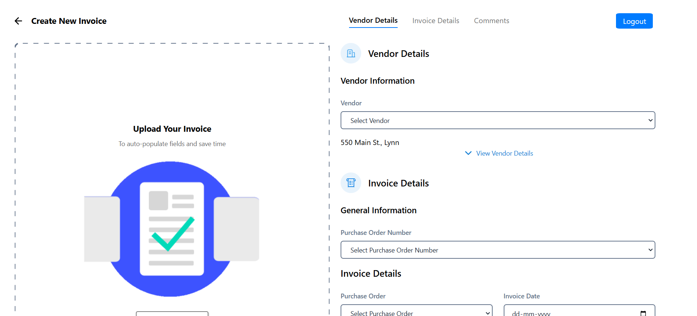

# Invoice Management System

🌐 **Live Demo**: https://react-invoice-vardaan.vercel.app/

## Overview

The Invoice Management System is a modern web application designed to streamline vendor, invoice, and expense management. Built with cutting-edge web technologies, this application provides a robust solution for businesses to track and manage their financial documentation efficiently.




## 🚀 Features

- Vendor Management
- Invoice Processing
- Expense Tracking
- Commenting System
- Secure Authentication
- Form Validation
- Intuitive Interface

## 💻 Technology Stack

### Frontend

- **React**: Core UI library
- **Vite**: Modern build tool
- **Formik**: Form management
- **Yup**: Schema validation
- **Lucide React**: Icon library
- **Styled Components**: CSS-in-JS styling solution

### Authentication

- Local storage session management
- Secure login/logout flow

## 🛠 Prerequisites

- Node.js (v14+)
- npm

## 📦 Installation

### Clone the Repository

```bash
git clone https://github.com/vardaan-bhatia/React-InvoiceForm.git
cd invoice-management-system
```

### Install Dependencies

```bash
npm install
```

### Run Development Server

```bash
npm run dev
```

Access the application at `http://localhost:3000`

## 📬 Contact

Vardaan Bhatia - vardaanbhatia55@gmail.com
